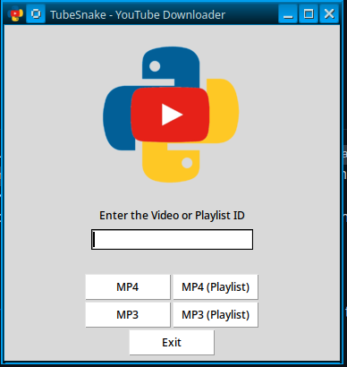

# TUBESNAKE - THE SIMPLE PYTHON YOUTUBE DOWNLOADER

TubeSnake is a simple Python3 application for downloading YouTube videos in MP4 and MP3 format all nicely wrapped in a cross-platform Tk GUI. TubeSnake is lightweight in filesize and quite fast at downloading videos, and due to its small size and portable libraries can be run on all OSes capable of running the Tk graphical library. The application is simple for anyone to use and you know it can be trusted due to its open-source nature and simple-to-read coding language.

## HOW TO USE

Setup is a breeze in TubeSnake thanks to the simple Setup Wizard script packaged with it, or Setup can be done within your Command Prompt or Terminal with either `pip install -r requirements.txt` on Unix-based OSes or `python -m pip install -r requirements.txt` in Windows. TubeSnake is very straight forward in its usage, first you take the URL of the YouTube video you wish to download and copy the Video ID from the URL.

***Example:***

https://www.youtube.com/watch?v=Gn-twrhKl-0 is the video we wish to download, so we take the string after the v= and copy-paste it into TubeSnake as such:

TubeSnake will prompt for a directory to save the file into, and upon selection will proceed to download your video in either MP4 or MP3 file format to the chosen folder. Now you can sit back, relax, and enjoy your favourite YouTube videos without having to worry about using up your internet data.

